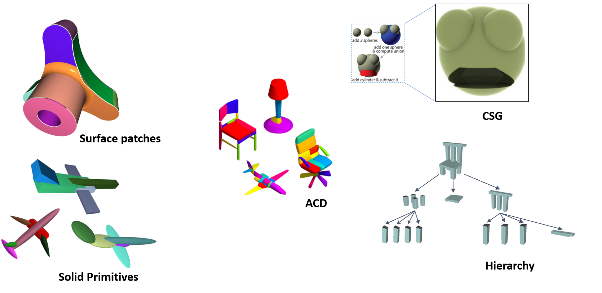

# Awesome-List-of-Shape-Decomposition-Papers
The ability to parse 3D objects into its constituent parts is
essential for humans to understand and interact with the
surrounding world. Imparting this skill into machines is important for various computer graphics, computer vision
and robotics tasks. Machines endowed with this skill can better interact with its surrounding, perform shape
editing, texturing, recomposing , tracking  and animation.

This list contains a list of papers that concerns with shape decomposition using both classical and modern approaches.

## Deep Learning Based Approaches
1. [CSGNet: Neural Shape Parser for Constructive Solid Geometry](https://arxiv.org/abs/1712.08290) CVPR 2018
2. [Neural Shape Parsers for Constructive Solid Geometry](https://ieeexplore.ieee.org/document/9293398) TPAMI 2020
3. [Superquadrics Revisited: Learning 3D Shape Parsing beyond Cuboids](https://arxiv.org/abs/1904.09970) CVPR 2019
4. [Learning Unsupervised Hierarchical Part Decomposition of 3D Objects from a Single RGB Image](https://arxiv.org/pdf/2004.01176.pdf) CVPR 2020
5. [Neural Parts: Learning Expressive 3D Shape Abstractions with Invertible Neural Networks](https://arxiv.org/pdf/2103.10429.pdf) CVPR 2021
6. [BSP-Net: Generating Compact Meshes via Binary Space Partitioning](https://arxiv.org/abs/1911.06971) CVPR 2020
7. [CvxNet: Learnable Convex Decomposition](https://arxiv.org/abs/1909.05736) CVPR 2020
8. [Learning Shape Abstractions by Assembling Volumetric Primitives](https://arxiv.org/pdf/1612.00404.pdf) CVPR 2017
9. [UCSG-Net -- Unsupervised Discovering of Constructive Solid Geometry Tree](https://arxiv.org/abs/2006.09102) Neurips 2020
10. [Learning Shape Templates with Structured Implicit Functions](https://arxiv.org/abs/1904.06447) ICCV 2019
11. [Local Deep Implicit Functions for 3D Shape](https://ldif.cs.princeton.edu/assets/paper.pdf) CVPR 2020
12. [ParSeNet: A Parametric Surface Fitting Network for 3D Point Clouds](https://arxiv.org/abs/2003.12181) ECCV 2020

## Classical Approaches
